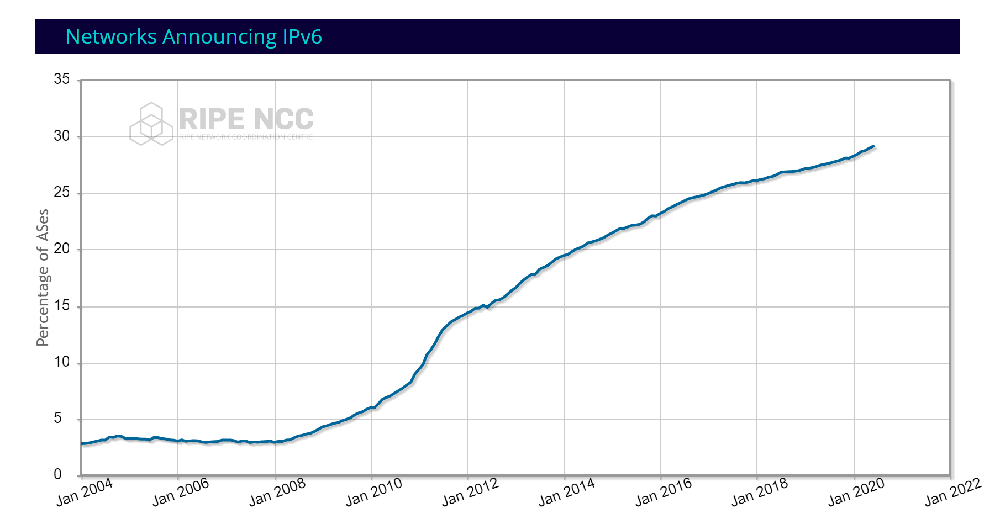

Nowadays all the new technology domains like 5G connectivity, Internet of Things (IoT), Cloud Computing, Artificial Intelligence (AI) are accelerating digitalization and many things that were previously not connected are getting connected. As more and more devices, vehicles, sensors and home appliances go online, enabling IP on everything becomes a vision and industry trend.

In this context, all the statistics show that IPv6 is growing constantly and faster than IPv4 in all measures such as number of users, percentage of content, and amount of traffic. For the first time in history, the user–network–content communication chain is ready for IPv6 and this means that the industry has selected IPv6 for the future.

On the other hand, networking field is in constant evolution and all the new use cases and scenarios were not mature or even did not exist when IPv6 was introduced. For this reason, IPv6 started its massive introduction recently and keeps evolving to prepare for the future and meet the new challenges as they arise.

IPv6 evolution needs have been tackled with the creation of IPE (IPv6 Enhanced Innovation) in 2021 as an ETSI ISG under the guidance of IPv6 Forum, expanding the scope of the previous ISG IP6 to the more advanced IETF-defined functionalities. After two years of work, the IPE ISG sees the participation of 100+ players and published industry reports. The first report analysed the gap of the current IPv6 in relation to the major industry scenarios. Following reports analysed the identified scenarios (e.g., 5G, Cloud integration, Industrial Internet), defining the best practices, guidelines and testing methodologies. The next step will be fully supported by IPv6 Forum, in continuity with the previous phases. More reports will be delivered and PoC activities will be carried on to validate the technology with direct involvement of the major Industry Players with the scope to accelerate the IPv6 transition to support digital transformation and fair market competition.

The progress of IPv6 can be showed looking at the percentage of networks (Autonomous Systems) that announce one or more IPv6 prefixes in the RIPE NCC service region:

  

IPv6 Enhanced Council opens the door to new opportunities for industry players by applying IPv6 technology to various scenarios and end-to-end solutions, in order to enable a new era of IPv6-based services and networks. IPv6 Enhanced Council will close the loop among the IP Industry players, each of which will benefit from this alignment: SDOs (IETF) will concentrate effort in delivering missing specifications, Manufacturer will implement functionalities of value on the market and Operators/Vertical Industries will be able to properly underpin Digital Transformation in a simpler way with straight forward and cost effective technologies.